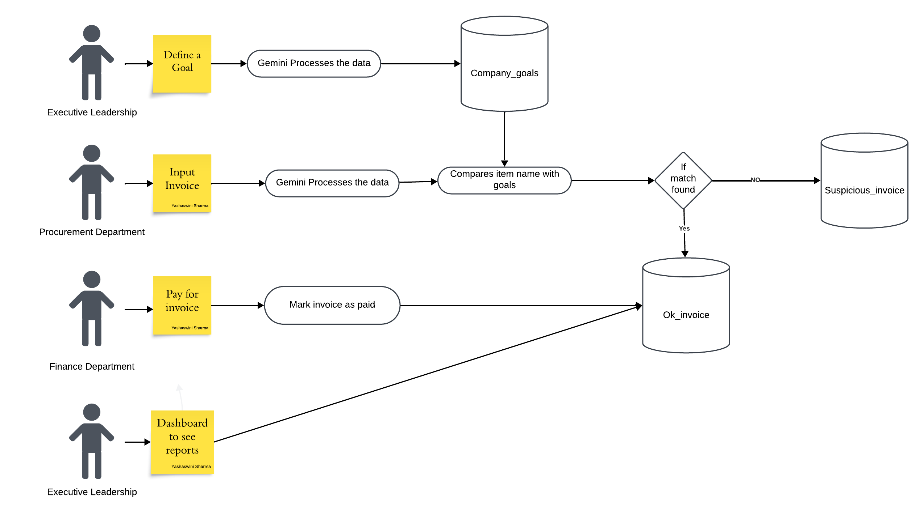

# Google Girl Hackathon - Streamline

A tool to analyze invoices and verify purchases against company sustainability goals.

## Demo Video

Watch a demonstration of the Green Goals Helper in action:

[📺 Watch Demo Video](https://drive.google.com/file/d/1Kz7YBiLT4-nGxouNvckboLn3FVevzwr0/view?usp=sharing)

[](https://drive.google.com/file/d/1Kz7YBiLT4-nGxouNvckboLn3FVevzwr0/view?usp=sharing)

## System Architecture

Below is the system architecture diagram showing the flow of our web application:



*System architecture diagram showing the flow of data and components interaction in Green Goals Helper*

## Prerequisites

- Python 3.11 or higher
- Tesseract OCR engine
- Google Cloud API key for Gemini

## Installation

1. Install Tesseract OCR:
```bash
# Ubuntu/Debian
sudo apt-get update
sudo apt-get install tesseract-ocr

# MacOS
brew install tesseract

# Windows
# Download installer from: https://github.com/UB-Mannheim/tesseract/wiki
```

2. Clone the repository:
```bash
git clone https://github.com/Yashaswini-Sharma/Streamline
cd ggh
```

3. Create and activate virtual environment:
```bash
python -m venv venv
source venv/bin/activate  # On Windows: venv\Scripts\activate
```

4. Install Python dependencies:
```bash
pip install -r requirements.txt
```

5. Set up environment variables:
Create a `.env` file in the project root with:
```
GEMINI_API_KEY=your_api_key_here
```

## Project Structure

```
ggh/
├── screen/
│   └── upload_invoice.py
|   └── accounts_payable.py
|   └── company_goals.py
|   └── expenditure analysis.py

├── utils/
│   └── similarity_checker.py
├── .env
├── company_goals.csv
├── invoice_data.csv
├── ap.csv
├── requirements.txt
└── README.md
```

## Running the Application

1. Ensure all configuration files are in place:
   - `.env` file with API key
   - `company_goals.csv` with defined goals

2. Start the Streamlit application:
```bash
streamlit run app.py
```

## Requirements

The `requirements.txt` file contains:
```
streamlit==1.42.2
python-dotenv==1.0.1
pandas==2.2.3
Pillow==11.1.0
pytesseract==0.3.13
google-generativeai==0.8.4
matplotlib==3.10.0
```

## Usage

1. Access the web interface (usually at http://localhost:8501)
2. Upload an invoice image (supported formats: PNG, JPG, JPEG, WEBP)
3. Click "Extract Data" to process the invoice
4. Review results and check for any suspicious items


## Troubleshooting

- If OCR fails, ensure Tesseract is properly installed and accessible
- For API errors, verify your Gemini API key is correct
- For CSV errors, check file permissions and format of company_goals.csv
- If Gemini Model fails cause someone changed Model names in the middle of the night so the product doesn't work anymore despite working perfectly fine yesterday, please list all models select the relevant one paste it in model names and give the gemini employee who did that a piece of your mind.
